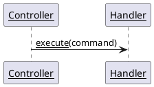
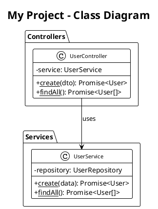

# PlantUML Interactive Documentation

## Overview
Creating interactive PlantUML diagrams with clickable links that open source files in VS Code, enabling seamless navigation between documentation and code.

## Key Concepts

### 1. PlantUML Link Syntax
PlantUML supports hyperlinks using `[[URL text]]` or `[[URL]]` syntax:

```plantuml
class MyClass [[vscode://file//absolute/path/to/file.ts]] {
  + method(): void
}
```

### 2. VS Code File Protocol
Use `vscode://file/` protocol with absolute paths to open files in VS Code:
- Format: `vscode://file//Users/user/project/src/file.ts`
- With line numbers: `vscode://file//Users/user/project/src/file.ts:42`
- Works in browser-rendered SVG files, not in VS Code PlantUML preview

### 3. Method-Level Links
Link individual methods to their definitions:

```plantuml
class HeroesController [[vscode://file//path/to/controller.ts]] {
  + [[vscode://file//path/to/controller.ts:18 createHero]](dto): Promise<Hero>
  + [[vscode://file//path/to/controller.ts:25 killDragon]](id): Promise<Result>
}
```

## Implementation Guide

### Step 1: Add Links to Class Diagrams

```plantuml
@startuml
skinparam hyperlinkColor #000000

class MyClass [[vscode://file//absolute/path/file.ts]] {
  + [[vscode://file//absolute/path/file.ts:10 method1]](): void
  + [[vscode://file//absolute/path/file.ts:15 method2]](): string
}
@enduml
```



### Step 2: Add Links to Sequence Diagrams



### Step 3: Generate SVG Files

Create a generation script:

```bash
#!/bin/bash
# Generate SVG with links
plantuml -tsvg docs/diagram.puml -o generated

# Remove underlines from links
for svgfile in docs/generated/*.svg; do
  sed -i '' 's/<defs\/>/<defs><style type="text\/css">a text[text-decoration="underline"] { text-decoration: none !important; }<\/style><\/defs>/' "$svgfile"
done

# Open in browser
open docs/generated/diagram.svg
```

### Step 4: Style Hyperlinks

```plantuml
@startuml
!theme plain
skinparam hyperlinkColor #000000
' Note: hyperlinkUnderline false causes NullPointerException in PlantUML
' Use CSS post-processing instead to remove underlines
@enduml
```

## Best Practices

### 1. Use Absolute Paths
Always use absolute paths for `vscode://file/` protocol:
```plantuml
' ✅ Good
class MyClass [[vscode://file//Users/user/project/src/file.ts]]

' ❌ Bad (relative paths don't work)
class MyClass [[vscode://file/./src/file.ts]]
```

### 2. Include Line Numbers
Add line numbers to jump directly to method definitions:
```plantuml
+ [[vscode://file//path/to/file.ts:42 methodName]]()
```

### 3. Find Line Numbers Programmatically
Use grep to find method line numbers:
```bash
grep -n "methodName" src/file.ts | head -1
```

### 4. Style for Readability
```plantuml
skinparam hyperlinkColor #000000  ' Black links (less intrusive than blue)
skinparam classFontSize 11         ' Readable font size
```

### 5. Post-Process SVG Files
Remove underlines using CSS injection:
```bash
sed -i '' 's/<defs\/>/<defs><style>a text[text-decoration="underline"] { text-decoration: none !important; }<\/style><\/defs>/' file.svg
```

## Known Limitations

### PlantUML Preview in VS Code
- Links using `[[URL]]` syntax don't work in VS Code's PlantUML preview
- Preview renders in webview context which blocks `vscode://file/` protocol
- **Solution**: Generate SVG files and open in browser

### HyperlinkUnderline Parameter Bug
- `skinparam hyperlinkUnderline false` causes NullPointerException in PlantUML
- **Solution**: Use CSS post-processing on SVG files instead

### Browser Security
- Some browsers may block `vscode://` protocol
- **Solution**: Ensure VS Code is registered as the protocol handler

## Complete Example

### diagram.puml


### generate-docs.sh
```bash
#!/bin/bash

echo "🎨 Generating interactive diagrams..."

# Generate SVG files
plantuml -tsvg docs/*.puml -o generated

# Remove underlines
echo "✨ Removing underlines from links..."
for svgfile in docs/generated/*.svg; do
  if [ -f "$svgfile" ]; then
    sed -i '' 's/<defs\/>/<defs><style type="text\/css">a text[text-decoration="underline"] { text-decoration: none !important; }<\/style><\/defs>/' "$svgfile"
  fi
done

echo "✅ Done! Opening in browser..."
open docs/generated/MyProject-ClassDiagram.svg
```

## Automation Tips

### 1. Project-wide Script
Create a script that generates all diagrams:
```bash
#!/bin/bash
SCRIPT_DIR="$( cd "$( dirname "${BASH_SOURCE[0]}" )" && pwd )"
PROJECT_ROOT="$(dirname "$SCRIPT_DIR")"

plantuml -tsvg "$PROJECT_ROOT/docs"/*.puml -o generated

# Post-process all SVG files
find "$PROJECT_ROOT/docs/generated" -name "*.svg" -exec \
  sed -i '' 's/<defs\/>/<defs><style type="text\/css">a text[text-decoration="underline"] { text-decoration: none !important; }<\/style><\/defs>/' {} \;
```

### 2. Git Hook
Auto-generate diagrams on commit:
```bash
# .git/hooks/pre-commit
#!/bin/bash
./scripts/generate-diagrams.sh
git add docs/generated/*.svg
```

### 3. CI/CD Integration
Generate diagrams in CI pipeline:
```yaml
# .github/workflows/docs.yml
- name: Generate PlantUML diagrams
  run: |
    sudo apt-get install plantuml
    ./scripts/generate-diagrams.sh
    
- name: Deploy docs
  uses: peaceiris/actions-gh-pages@v3
  with:
    github_token: ${{ secrets.GITHUB_TOKEN }}
    publish_dir: ./docs/generated
```

## Troubleshooting

### Links Don't Work in VS Code
**Problem**: Clicking links in PlantUML preview shows `vscode-webview://` URL  
**Solution**: Open SVG files in browser instead

### Java Error When Generating
**Problem**: PlantUML requires Java runtime  
**Solution**: 
```bash
# macOS
brew install openjdk@17
brew install plantuml

# Ubuntu
sudo apt-get install default-jre plantuml
```

### Underlines Still Visible
**Problem**: CSS injection didn't work  
**Solution**: Check sed command syntax (macOS requires `-i ''`, Linux requires `-i`)

### Links Open Wrong Files
**Problem**: Relative paths used instead of absolute  
**Solution**: Always use absolute paths with `vscode://file/` protocol

## Advanced Techniques

### Dynamic Path Resolution
Generate diagrams with absolute paths dynamically:
```bash
#!/bin/bash
PROJECT_ROOT="$(pwd)"

# Replace placeholder with absolute path
sed "s|PROJECT_ROOT|$PROJECT_ROOT|g" diagram.template.puml > diagram.puml

plantuml -tsvg diagram.puml -o generated
```

### Multi-Repository Links
Link to files in different repositories:
```plantuml
class SharedUtil [[vscode://file//Users/user/shared-lib/src/util.ts]] {
  + [[vscode://file//Users/user/shared-lib/src/util.ts:10 helper]](): void
}
```

### Documentation Website Integration
Embed interactive SVG in documentation:
```markdown
# Architecture

<object data="diagrams/architecture.svg" type="image/svg+xml">
  
</object>

Click on any component to view source code.
```

## Summary

**Key Takeaways:**
1. Use `vscode://file/` protocol with absolute paths for clickable links
2. Add `:line` suffix to jump to specific line numbers
3. Generate SVG files (don't rely on VS Code preview)
4. Post-process SVG with CSS to remove underlines
5. Use `skinparam hyperlinkColor #000000` for black links
6. Create automation scripts for diagram generation

**Result**: Interactive documentation where every class, method, and component is clickable and opens the corresponding source file in VS Code at the exact line number.
